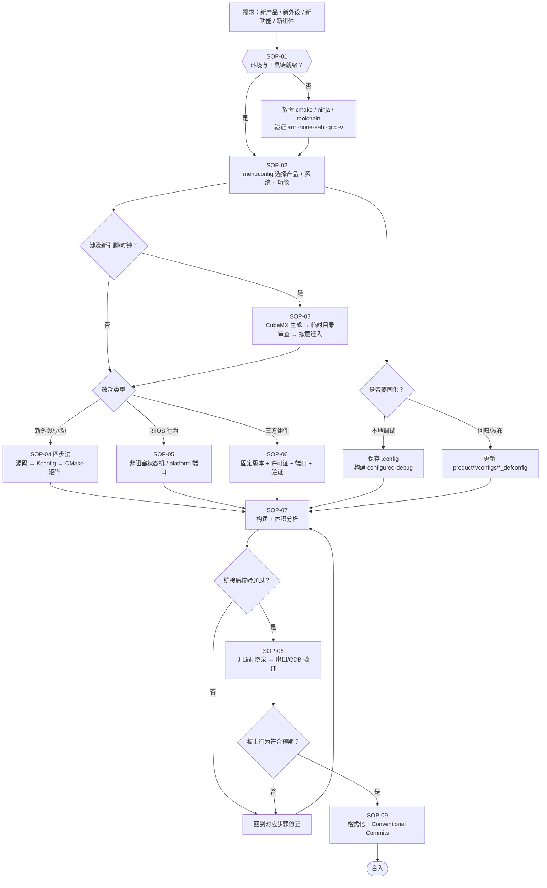

# STM32F103 模块化嵌入式开发标准作业程序 (SOP)

> **文档版本**：V2.0（product/platform 三系统架构）
>
> **适用对象**：嵌入式软件工程师、固件开发工程师、硬件调试工程师
>
> **适用平台**：STM32F103 系列（C8T6 / ZET6 等）
>
> **工程体系**：CMake + Ninja 单一构建定义 + Kconfig 可视化裁剪 + 产品/运行时分层

---

## 标准作业主流程

从需求到合入的完整路径。配置、构建、烧录三条主线在 SOP-07 与 SOP-08 汇合。



---

## 📋 目录索引

0. [标准作业主流程](#标准作业主流程)
1. [SOP-01：开发环境初始化与工具链准备](#sop-01开发环境初始化与工具链准备)
2. [SOP-02：Kconfig 可视化裁剪与功能配置](#sop-02kconfig-可视化裁剪与功能配置)
3. [SOP-03：STM32CubeMX 硬件引脚配置与代码同步](#sop-03stm32cubemx-硬件引脚配置与代码同步)
4. [SOP-04：新增外设模块与 BSP 驱动开发规范](#sop-04新增外设模块与-bsp-驱动开发规范)
5. [SOP-05：RTOS 实时操作系统实战开发与多任务切换](#sop-05rtos-实时操作系统实战开发与多任务切换)
6. [SOP-06：第三方开源库 (LwIP/cJSON/RTT) 引入与调用](#sop-06第三方开源库-lwipcjsonrtt-引入与调用)
7. [SOP-07：极速编译构建与固件体积分析](#sop-07极速编译构建与固件体积分析)
8. [SOP-08：硬件烧录、J-Link 在线仿真与排错](#sop-08硬件烧录j-link-在线仿真与排错)
9. [SOP-09：代码格式化与版本提交规范](#sop-09代码格式化与版本提交规范)

---

## SOP-01：开发环境初始化与工具链准备

### 目的
确保开发主机具备交叉编译、构建、图形配置及调试烧录能力，统一团队环境标准。

### 前置条件
- 操作系统：Windows 10/11 64-bit、Linux 或 macOS。
- 已安装 Python 3.8+ 及 Git。
- 当前入库工具和 preset 已在 Windows 验证；Linux/macOS 需要提供对应平台的
  CMake、Ninja、GNU Arm 工具链并维护本地 user preset。

### 操作步骤


1. **便携式免安装工具链准备 (推荐)**：
   - 将 `arm-gnu-toolchain` 解压至工程根目录下的 `tools/toolchain/`。
   - 确保路径 `tools/toolchain/bin/arm-none-eabi-gcc` 存在。
2. **环境变量临时注入 (可选)**：
   - Windows 终端执行：
     ```cmd
     call tools\env_setup.bat
     ```
   - Linux/macOS 终端执行：
     ```bash
     source tools/env_setup.sh
     ```
3. **环境验证指令**：
   ```bash
   arm-none-eabi-gcc -v
   cmake --version
   ninja --version
   ```

---

## SOP-02：Kconfig 可视化裁剪与功能配置

### 目的
通过图形化菜单直观选择产品板型、运行模式（裸机 / RT-Thread / FreeRTOS）和启用的板级外设。

### 操作步骤
1. **启动配置菜单**：
   - **终端交互模式**：
     ```bash
     make menuconfig
     # 或
     python scripts/menuconfig.py
     ```
   - **窗口图形界面模式**：
     ```bash
     make guiconfig
     # 或
     python scripts/menuconfig.py --gui
     ```
2. **核心选项配置流程**：
   - `Product Board Selection` -> 选择 BluePill C8 或正点原子精英 ZE。
   - `Operating System (RTOS) Selection` -> 选择 `Bare-metal`、`RT-Thread Nano` 或 `FreeRTOS`。
   - `Board Support Package (BSP) Configuration` -> 勾选/取消板载 LED、按键、串口等外设。
3. **保存并生成**：
   - 键盘操作：按 `S` 保存为 `.config`，按 `Q` 退出。
   - `.config` 只保存本地选择；CMake 在每个 `build/out/<preset>/generated/`
     独立生成 `autoconf.h` 和 `kconfig.cmake`。
4. **固定配置规则**：
   - `.config` 只供本地 `configured-debug` 使用，不提交版本库。
   - 可复现配置必须更新到 `product/<board>/configs/<system>_defconfig`。
   - 产品选择同时决定 MCU、容量、启动文件、链接脚本参数和板载资源，不能再单独
     选择不匹配的芯片。

---

## SOP-03：STM32CubeMX 硬件引脚配置与代码同步

### 目的
利用 STM32CubeMX 可视化配置时钟树与外设引脚，并将初始化代码规范接入本工程。

### 操作规范
1. **引脚与调试保护配置**：
   - `SYS` -> `Debug` 必须选择 **`Serial Wire`**。
   - `RCC` -> `High Speed Clock (HSE)` 选择 `Crystal/Ceramic Resonator`。
2. **时钟树配置 (Clock Configuration)**：
   - 输入频率设为 8MHz，PLL 9 倍频，`HCLK` 锁定为 **`72MHz`**。
3. **代码生成器设置 (Code Generator)**：
   - 勾选 `Copy only the necessary library files`。
   - 勾选 **`Generate peripheral initialization as a pair of '.c/.h' files per peripheral`**。
   - 勾选 **`Keep User Code when re-generating`**。
4. **代码放置归属**：
   - 生成代码先放在仓库外临时目录，禁止直接覆盖 `drivers/`、`platform/` 或
     `product/`。
   - 时钟、引脚和产品能力迁入 `product/*/include/product_config.h`；外设初始化
     提取到 `bsp/`；中断和系统专用胶水放到 `platform/`。
   - CMSIS/HAL 只能按可追溯的完整上游版本升级并保留许可证，不能从单次生成结果
     零散覆盖。

---

## SOP-04：新增外设模块与 BSP 驱动开发规范

### 目的
规范新增硬件外设（如 SPI Flash、I2C OLED、定时器等）的产品能力、Kconfig 和
CMake 单一注册流程。

### 开发四步法

```
[1. 编写源码]         [2. 注册 Kconfig]       [3. 注册 CMake 源码]      [4. 验证矩阵]
bsp_oled.c/h  -->   bsp/Kconfig     -->   bsp/CMakeLists.txt  -->  make matrix
```

1. **步骤 1：新建头文件与源文件**
   - 在 `bsp/inc/` 创建 `bsp_oled.h`，在 `bsp/src/` 创建 `bsp_oled.c`。
2. **步骤 2：在 `bsp/Kconfig` 中注册菜单项**
   ```kconfig
   config BSP_USING_OLED
       bool "Enable I2C OLED Display Driver"
       default n
       help
           Enable 0.96 inch SSD1306 OLED display driver.
   ```
3. **步骤 3：在 `bsp/CMakeLists.txt` 中添加条件编译规则**
   ```cmake
   if(CONFIG_BSP_USING_OLED)
       target_sources(bsp_lib PRIVATE src/bsp_oled.c)
   endif()
   ```
4. **步骤 4：在 `bsp/inc/bsp.h` 与 `bsp/src/bsp.c` 中按宏接入初始化**
   ```c
   #if defined(CONFIG_BSP_USING_OLED)
   #include "bsp_oled.h"
   #endif

   HAL_StatusTypeDef BSP_Init(void)
   {
       /* ... */
       #if defined(CONFIG_BSP_USING_OLED)
       BSP_OLED_Init();
       #endif
       return HAL_OK;
   }
   ```

---

## SOP-05：RTOS 实时操作系统实战开发与多任务切换

### 目的
规范裸机与实时操作系统的开发模式，确保任务创建、调度器启动与中断处理安全。

### 1. 共享应用规范

应用只实现 `App_Init()` 和非阻塞的 `App_Process(uint32_t now_ms)`。LED、按键和
协议状态机使用传入的毫秒时间推进，不调用 `HAL_Delay()`、`rt_thread_mdelay()`
或 `vTaskDelay()`，也不包含任一 RTOS 头文件。

```c
void App_Process(uint32_t now_ms)
{
    if (time_reached(now_ms, next_deadline_ms))
    {
        BSP_LED_Toggle();
        next_deadline_ms += interval_ms;
    }
}
```

### 2. 系统运行时规范

- `platform/src/main.c` 是唯一入口，只调用 `SystemRuntime_Start()`。
- 裸机端口在 super-loop 中调用 `App_Process()`；RT-Thread 和 FreeRTOS 端口各自
  创建一个应用线程/任务，并负责休眠和启动调度器。
- RTOS 专用任务、队列和同步适配只能放在 `platform`，通过内核无关接口提供给
  应用。
- 三个端口分别拥有唯一 SysTick 实现，BSP 和应用不得定义或重配 SysTick。
- 线程/任务参数来自 Kconfig，创建或调度失败必须进入 `BSP_FatalError()`。

详细实现分别见 [RT-Thread 端口](porting_guides/02_rt_thread_nano_porting.md) 和
[FreeRTOS 端口](porting_guides/03_freertos_porting.md)。

---

## SOP-06：第三方开源库 (LwIP/cJSON/RTT) 引入与调用

### 目的
规范将完整、可追溯的第三方组件接入 `third_party/`。当前目录中的现有组件均为
不完整参考占位，不参与 menuconfig 或固件构建。

### 操作步骤
1. **固定源码版本并保留许可证**：在仓库外获取指定 tag/commit，核对来源与许可后
   再导入 `third_party/<component>/`。版本、补丁和许可证必须可审计，不能用浮动
   分支或不完整头文件冒充已集成组件。
2. **完成端口与测试**：只有具备目标平台端口、CMake 显式源码清单和构建测试后，
   才能新增 Kconfig 选项；禁止为缺失源码的目录创建可选功能。

---

## SOP-07：极速编译构建与固件体积分析

### 1. CMake + Ninja 固定 preset（规范入口）
```bash
cmake --preset bluepill-baremetal-debug
cmake --build --preset bluepill-baremetal-debug

# Windows 包装脚本
build\build.bat atk-elite-freertos-release
build\build.bat all
```

### 2. GNU Make 便捷包装
```bash
# Make 仍调用 CMake preset，不维护独立源码清单
make PRESET=bluepill-baremetal-debug

# 清理 build/out
make clean
```

### 3. 固件体积与内存分析
编译成功后，系统自动调用 `arm-none-eabi-size` 输出 Berkeley 格式统计：
```
   text    data     bss     dec     hex filename
   4320     108    1560    5988    1764 STM32F103_Study.elf
```
- **Flash 占用计算**：$\text{Flash} = \text{text} + \text{data}$（本例为 $4320 + 108 = 4428$ 字节，占 64KB Flash 的 6.75%）。
- **RAM 占用计算**：$\text{RAM} = \text{data} + \text{bss}$（本例为 $108 + 1560 = 1668$ 字节，占 20KB RAM 的 8.14%）。

---

## SOP-08：硬件烧录、J-Link 在线仿真与排错

### 1. 硬件连接 (J-Link SWD 模式)
J-Link 与 STM32F103 推荐采用 SWD 4 线制连接（必要时接入复位线）：

| J-Link 20Pin 引脚 | STM32F103 目标板引脚 | 作用说明 |
| :--- | :--- | :--- |
| **Pin 1 (VTref)** | **3.3V / VDD** | **核心关键**：目标板参考电平检测，J-Link 须据此开启电平转换缓冲 |
| **Pin 7 (SWDIO)** | **PA13** | SWD 串行数据输入/输出 |
| **Pin 9 (SWCLK)** | **PA14** | SWD 串行时钟信号 |
| **Pin 4/6/8/20 (GND)** | **GND** | 信号参考地 |
| *(可选) Pin 15 (RESET)* | **NRST** | 硬件复位引脚（芯片休眠或 SWD 误关闭时强行复位） |

> [!IMPORTANT]
> **关于 OpenOCD 与 ST-Link 说明**：
> 本工程原生适配 **SEGGER J-Link**。您**完全不需要安装 OpenOCD** 或 ST-Link 驱动！
> 烧录脚本 `scripts/flash.bat` 直接驱动官方 `JLink.exe`，下载速率更快、校验严谨且无弹窗卡死问题。

### 2. 一键烧录指令
烧录脚本会自动匹配固件（HEX 优先），并根据预设名称自动推断目标芯片型号（如 `STM32F103ZE` 或 `STM32F103C8`）：

```bash
# Windows: 烧录指定预设构建产物
scripts\flash.bat atk-elite-baremetal-debug
scripts\flash.bat bluepill-baremetal-debug

# Windows: 烧录当前 menuconfig 激活的配置
scripts\flash.bat configured-debug

# Windows: 显式指定芯片型号（可选）
scripts\flash.bat configured-debug STM32F103ZE

# Linux / macOS
./scripts/flash.sh atk-elite-baremetal-debug

# 或通过 Make 便捷调用
make PRESET=atk-elite-baremetal-debug flash
```

### 3. VS Code 在线断点仿真
本工程 `.vscode/launch.json` 已原生配置为 J-Link GDB Server：
1. 确保安装 VS Code 插件：`Cortex-Debug` 与 `C/C++`。
2. 确保已编译生成目标 ELF 固件（如点击状态栏 Build 或运行任务 `Build active menuconfig`）。
3. 切换至 VS Code **运行与调试**面板（`Ctrl+Shift+D`），根据板卡选择配置：
   - `Debug active config as ALIENTEK F103ZE (J-Link)`
   - `Debug active config as BluePill C8 (J-Link)`
4. 按键盘 **`F5`** 启动调试，支持源码级图形化断点、单步执行（F10/F11）、调用栈、变量监视与外设寄存器实时观测。

### 4. J-Link 常见排错指南
- **错误：Cannot connect to J-Link**：
  - 检查 J-Link USB 数据线是否插牢，驱动是否由 SEGGER 正常识别（设备管理器中显示 `J-Link driver`）。
- **错误：Cannot connect to target / VTref=0.000V**：
  - 检查目标板是否已独立供电（开发板电源开关/指示灯是否点亮）。
  - 检查 J-Link Pin 1 (VTref) 是否连接到目标板的 3.3V 引脚。若 VTref 为 0V，J-Link 将拒绝驱动 SWD 总线。
- **错误：Device STM32F103xx halted but cannot erase/program (Flash locked)**：
  - 若芯片开启了读保护 (RDP)，可使用 J-Link Commander 手动输入 `unlock` 解锁芯片（注意：会全盘擦除 Flash）。
- **下载后芯片不运行**：
  - 脚本已自动执行 `r` (复位) 与 `g` (运行)。若使用了某些特殊硬件复位电路，可轻按板载 RESET 按键一次。

---

## SOP-09：代码格式化与版本提交规范

### 1. 批量代码格式化
在提交 Git 代码前，必须执行自动化格式化：
- **Windows**：双击运行 `tools\format\format_code.bat`。
- **Linux/macOS**：终端运行 `./tools/format/format_code.sh`。

### 2. Git 提交规范 (Conventional Commits)
- `feat:` 新增功能/外设驱动（如 `feat(bsp): add oled ssd1306 driver`）
- `fix:` 修复 Bug（如 `fix(usart): fix baudrate clock division error`）
- `docs:` 知识库与文档更新（如 `docs: update freertos porting manual`）
- `refactor:` 架构重构（如 `refactor(kconfig): optimize third_party options`）
- `tools:` 工具链与构建脚本变更（如 `tools: update jlink flash script`）
