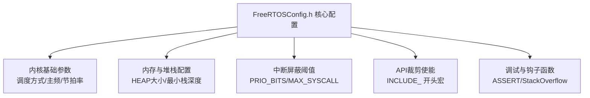
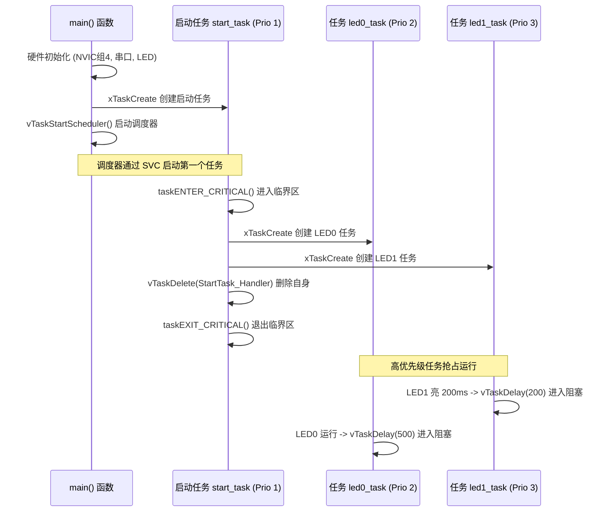

# STM32F103 FreeRTOS 移植标准作业程序 (SOP)

> 本文档基于《STM32F1 FreeRTOS 开发手册 V1.1（ALIENTEK STM32F103 开发教程）》系统化整理，旨在为 STM32F103 全系列（Cortex-M3）平台提供一套标准化、工程化且经过严谨验证的 FreeRTOS 移植与配置 SOP。

---

## 目录
- [一、 移植前准备工作](#一-移植前准备工作)
  - [1. 硬件平台与开发环境](#1-硬件平台与开发环境)
  - [2. 基础裸机工程准备](#2-基础裸机工程准备)
  - [3. FreeRTOS 源码获取与结构剖析](#3-freertos-源码获取与结构剖析)
  - [4. 工程文件目录规划](#4-工程文件目录规划)
- [二、 阶段一：源码裁剪与工程引入](#二-阶段一源码裁剪与工程引入)
  - [1. 源码文件裁剪 (轻量化抽取)](#1-源码文件裁剪-轻量化抽取)
  - [2. 内存管理算法 (MemMang) 选型分析](#2-内存管理算法-memmang-选型分析)
  - [3. IDE/构建系统文件分组配置](#3-ide构建系统文件分组配置)
  - [4. 头文件包含路径配置](#4-头文件包含路径配置)
- [三、 阶段二：底层支持文件修改与系统对接](#三-阶段二底层支持文件修改与系统对接)
  - [1. 修改 sys.h (系统支持 OS 宏开关)](#1-修改-sysh-系统支持-os-宏开关)
  - [2. 修改 usart.c (中断退出与通信清理)](#2-修改-usartc-中断退出与通信清理)
  - [3. 重构 delay.c (SysTick 与延时体系适配)](#3-重构-delayc-systick-与延时体系适配)
  - [4. 处理中断向量重复定义冲突 (stm32f10x_it.c)](#4-处理中断向量重复定义冲突-stm32f10x_itc)
- [四、 阶段三：FreeRTOSConfig.h 核心配置裁剪](#四-阶段三freertosconfigh-核心配置裁剪)
  - [1. 配置文件引入与初始化](#1-配置文件引入与初始化)
  - [2. 基础内核运行参数宏配置](#2-基础内核运行参数宏配置)
  - [3. 内存与任务栈深度配置](#3-内存与任务栈深度配置)
  - [4. API 裁剪宏 (INCLUDE_ 开头)](#4-api-裁剪宏-include_-开头)
  - [5. 调试、断言与钩子函数配置](#5-调试断言与钩子函数配置)
- [五、 阶段四：Cortex-M3 中断体系与优先级规范](#五-阶段四cortex-m3-中断体系与优先级规范)
  - [1. Cortex-M3 中断优先级分组强制设定](#1-cortex-m3-中断优先级分组强制设定)
  - [2. FreeRTOS 中断管理与 BASEPRI 机制](#2-freertos-中断管理与-basepri-机制)
  - [3. 内核与系统调用中断优先级宏配置](#3-内核与系统调用中断优先级宏配置)
  - [4. ISR 中断安全调用红线 (FromISR 规范)](#4-isr-中断安全调用红线-fromisr-规范)
- [六、 阶段五：移植验证实验程序设计](#六-阶段五移植验证实验程序设计)
  - [1. 实验目标与任务拓扑架构](#1-实验目标与任务拓扑架构)
  - [2. 经典“启动任务模式”实现代码](#2-经典启动任务模式实现代码)
  - [3. 运行现象分析与验证标准](#3-运行现象分析与验证标准)
- [七、 阶段六：常见故障排查与避坑指南 (Troubleshooting)](#七-阶段六常见故障排查与避坑指南-troubleshooting)
  - [1. HardFault 硬件错误常见诱因与排查](#1-hardfault-硬件错误常见诱因与排查)
  - [2. 中断优先级配置错误引发的断言死循环](#2-中断优先级配置错误引发的断言死循环)
  - [3. 任务栈溢出排查与定位](#3-任务栈溢出排查与定位)
  - [4. 动态内存耗尽 (pvPortMalloc 返回 NULL)](#4-动态内存耗尽-pvportmalloc-返回-null)
- [八、 移植验收检查表 (Checklist)](#八-移植验收检查表-checklist)

---

## 一、 移植前准备工作

### 1. 硬件平台与开发环境
* **MCU 型号**：STM32F103 系列（Cortex-M3 内核，如 STM32F103C8T6、STM32F103ZET6 等）。
* **编译器/IDE**：Keil MDK (ARMCC/ARMCLANG) 或 GCC + CMake + Ninja。
* **硬件调试器**：ST-Link / J-Link / DAP-Link，具备串口转 USB 用于 `printf` 日志观测。

### 2. 基础裸机工程准备
选择一个最简且稳定的裸机例程作为母本（推荐正点原子基础跑马灯例程或具备以下模块的裸机工程）：
1. 包含 CMSIS 核心库文件（`core_cm3.c/h`, `stm32f10x.h`, `system_stm32f10x.c/h`）。
2. 包含基础外设驱动：GPIO（LED 指示灯）、USART1（115200bps 打印调试）。
3. 具备延时函数文件 `delay.c/delay.h`，系统配置文件 `sys.c/sys.h`。
4. 确保工程在未引入操作系统前，编译 0 Error、0 Warning，外设指示正常工作。

### 3. FreeRTOS 源码获取与结构剖析
官方下载解压 FreeRTOS 源码（推荐版本 V9.0.0，亦适用于 V10.x/V202x+）：
官方解压包包含两个核心文件夹：
* **`FreeRTOS-Plus/`**：包含 CLI、FAT、TCP/IP、Trace 等附加功能套件，基础内核移植**不需要**引入。
* **`FreeRTOS/`**：实时内核核心部分，其内部结构如下：
  * **`Demo/`**：各个芯片平台官方演示工程。其中 `CORTEX_STM32F103_Keil/` 或 `CORTEX_STM32F107_GCC_Rowley/` 是提取 `FreeRTOSConfig.h` 模板的重要参考。
  * **`License/`**：商业许可说明。
  * **`Source/`**：内核核心代码：
    * `include/`：所有核心系统接口头文件。
    * `portable/`：架构抽象适配层（不同编译器及芯片内核适配）。
    * `.c` 源文件：`tasks.c`（任务调度）、`queue.c`（消息队列与信号量）、`list.c`（链表）、`timers.c`（软件定时器）、`event_groups.c`（事件标志组）、`croutine.c`（协程，已较少使用）。

### 4. 工程文件目录规划
在基础工程根目录下创建专用的 `FreeRTOS` 中间件目录，规范组织结构：
```text
STM32F103_Project/
├── USER/                        # 主程序入口 main.c, stm32f10x_it.c
├── HARDWARE/                    # 板级外设 (LED, KEY, LCD, BEEP 等)
├── SYSTEM/                      # 系统底层驱动 (delay, sys, usart)
├── CORE/                        # CMSIS 核心支持与启动文件 startup_stm32f10x_xx.s
├── STM32F10x_FWLib/             # STM32 标准固件库源码与头文件
└── FreeRTOS/                    # FreeRTOS 内核根目录
    ├── include/                 # 源码 include/ 目录下的所有 .h 文件
    │   ├── FreeRTOSConfig.h     # 【核心配置】针对当前项目定制的配置文件
    │   ├── FreeRTOS.h
    │   ├── task.h
    │   ├── queue.h
    │   ├── semphr.h
    │   └── ...
    ├── src/                     # 核心源文件
    │   ├── tasks.c
    │   ├── queue.c
    │   ├── list.c
    │   ├── timers.c
    │   └── event_groups.c
    └── portable/                # 硬件适配层
        ├── MemMang/             # 内存堆管理实现
        │   └── heap_4.c         # 首选 heap_4（支持内存碎片合并回收）
        └── RVDS/ARM_CM3/        # Keil/ARMCC 环境下 Cortex-M3 适配文件
            ├── port.c           # 汇编与底层任务上下文切换实现
            └── portmacro.h      # 数据类型定义、开关中断与临界区宏
```
*(注：若使用 GCC 工具链，移植层路径对应为 `portable/GCC/ARM_CM3/`)*

---

## 二、 阶段一：源码裁剪与工程引入

### 1. 源码文件裁剪 (轻量化抽取)
1. **清理 `portable/` 目录**：
   官方源码 `portable/` 包含几十种架构和编译环境，移植到 STM32F103 (Keil MDK) 时，**仅保留**：
   - `portable/MemMang/`
   - `portable/RVDS/ARM_CM3/` (或 `portable/GCC/ARM_CM3/`)
   - `portable/keil/`（其内部为文本指引，可不选或删除）。
   其余无用架构文件夹（如 ARM_CM0, ARM_CM4F, ARM_CM7, PIC, MSP430, AVR 等）直接清理剔除。
2. **选择性保留内核 C 文件**：
   - **必选核心**：`tasks.c`, `list.c`, `queue.c`。
   - **功能组件**：`timers.c`（软件定时器）、`event_groups.c`（事件标志组）。
   - **淘汰组件**：`croutine.c`（协程机制官方已停止维护，无需加入工程）。

### 2. 内存管理算法 (MemMang) 选型分析
FreeRTOS 提供了 5 种内存分配机制 (`heap_1.c` ~ `heap_5.c`)，特性对比如下：

| 内存算法 | 核心机制 | 内存释放支持 | 碎片合并能力 | 适用典型场景 |
| :--- | :--- | :---: | :---: | :--- |
| **`heap_1.c`** | 线性数组指针递增分配 | ❌ 不支持 | ❌ 无 | 系统初始化后不再动态销毁任务/内核对象的极端简单系统 |
| **`heap_2.c`** | 最佳匹配链表管理 | ✅ 支持 | ❌ 无（产生碎片） | 每次申请释放大小固定、极少销毁对象的嵌入式系统 |
| **`heap_3.c`** | 封装 C 标准库 `malloc/free` | ✅ 支持 | 取决于编译器底层实现 | 仅挂载了标准 C 运行库的场景，不可重入且执行耗时不确定 |
| **`heap_4.c`** | **最先匹配 + 内存碎片自动合并** | **✅ 支持** | **✅ 具备（合并相邻空闲块）** | **通用绝大多数复杂嵌入式系统，官方推荐首选！** |
| **`heap_5.c`** | 基于 `heap_4` 算法，支持跨内存段 | ✅ 支持 | ✅ 具备 | 内部 SRAM + 外部扩展 SRAM/SDRAM 混合组成堆内存的系统 |

> [!TIP]
> **移植结论**：在 `FreeRTOS/portable/MemMang/` 目录下**只添加 `heap_4.c`**，将其余 `heap_1.c`、`heap_2.c`、`heap_3.c`、`heap_5.c` 移出构建编译范围，切勿同时添加多个 `heap_x.c`，否则会引发函数重复定义链接错误。

### 3. IDE/构建系统文件分组配置
打开 Keil MDK 工程管理（Manage Project Items），新建两个逻辑分组并添加对应文件：

* **分组 1：`FreeRTOS_CORE`**
  - `FreeRTOS/src/tasks.c`
  - `FreeRTOS/src/list.c`
  - `FreeRTOS/src/queue.c`
  - `FreeRTOS/src/timers.c`
  - `FreeRTOS/src/event_groups.c`
* **分组 2：`FreeRTOS_PORTABLE`**
  - `FreeRTOS/portable/RVDS/ARM_CM3/port.c`
  - `FreeRTOS/portable/MemMang/heap_4.c`

### 4. 头文件包含路径配置
在工程配置（`Project -> Options for Target -> C/C++ -> Include Paths`）中添加以下目录：
```text
..\FreeRTOS\include
..\FreeRTOS\portable\RVDS\ARM_CM3
```

---

## 三、 阶段二：底层支持文件修改与系统对接

正点原子等标准开发套件中的 `SYSTEM` 文件夹代码默认适配了裸机或 uC/OS 系统。接入 FreeRTOS 需进行针对性修改以实现平滑对接。

### 1. 修改 `sys.h` (系统支持 OS 宏开关)
将 OS 支持宏明确定义为 1：
```c
// 0: 不支持 OS; 1: 支持 OS (启用操作系统的底层适配)
#define SYSTEM_SUPPORT_OS   1
```

### 2. 修改 `usart.c` (中断退出与通信清理)
1. 包含 FreeRTOS 核心头文件：
   ```c
   #if SYSTEM_SUPPORT_OS
   #include "FreeRTOS.h"  // 替代原有的 uC/OS 头文件 includes.h
   #endif
   ```
2. 移除 uC/OS 专有的中断统计代码：
   在 `USART1_IRQHandler(void)` 中，删除进入中断处的 `OSIntEnter()` 以及退出处的 `OSIntExit()`。
3. （重要）若后续在串口中断中调用 FreeRTOS 队列或信号量等 API，其 NVIC 抢占优先级必须严格符合内核规范（详见第五章）。

### 3. 重构 `delay.c` (SysTick 与延时体系适配)
FreeRTOS 的心跳由 Cortex-M3 内部的 SysTick 滴答定时器提供驱动。为保证精准的微秒（us）非阻塞延时与毫秒（ms）系统任务调度延时共存，需对 `delay.c` 进行全面改造：

#### (1) 系统节拍中断处理函数 `SysTick_Handler`
```c
extern void xPortSysTickHandler(void);

// SysTick 滴答定时器中断服务函数
void SysTick_Handler(void)
{
    // 判断调度器是否已经启动，只有调度器运行后才递增心跳
    if(xTaskGetSchedulerState() != taskSCHEDULER_NOT_STARTED)
    {
        xPortSysTickHandler();
    }
}
```

#### (2) 初始化延时函数 `delay_init`
必须将 SysTick 时钟源配置为 **HCLK (72MHz)**，与 FreeRTOS 内核的节拍周期精准对齐：
```c
static u8  fac_us = 0;       // us 延时倍乘数
static u16 fac_ms = 0;       // ms 延时倍乘数，代表系统节拍最小周期

void delay_init(void)
{
    u32 reload;
    
    // 选择外部时钟源 HCLK (72MHz)，确保与 FreeRTOS 内核时钟一致
    SysTick_CLKSourceConfig(SysTick_CLKSource_HCLK);
    fac_us = SystemCoreClock / 1000000;
    
    // 根据 FreeRTOSConfig.h 中的 configTICK_RATE_HZ 计算每节拍的 reload 值
    reload = SystemCoreClock / 1000000;
    reload *= 1000000 / configTICK_RATE_HZ;
    
    fac_ms = 1000 / configTICK_RATE_HZ;  // 代表 OS 能够延时的最小节拍基数 (如 1ms)
    
    SysTick->CTRL |= SysTick_CTRL_TICKINT_Msk;   // 开启 SysTick 中断
    SysTick->LOAD  = reload;                     // 每 1/configTICK_RATE_HZ 秒触发一次中断
    SysTick->CTRL |= SysTick_CTRL_ENABLE_Msk;    // 开启 SysTick 计数器
}
```

#### (3) 微秒级延时 `delay_us` (无任务切换)
通过查询当前 SysTick 寄存器 `VAL` 差值进行递减计数，安全无阻塞，不会触发任务切换：
```c
void delay_us(u32 nus)
{
    u32 ticks;
    u32 told, tnow, tcnt = 0;
    u32 reload = SysTick->LOAD;
    ticks = nus * fac_us;                       // 所需节拍数
    told = SysTick->VAL;                        // 记录初值
    while(1)
    {
        tnow = SysTick->VAL;
        if(tnow != told)
        {
            if(tnow < told) tcnt += told - tnow; // SysTick 为递减计数器
            else tcnt += reload - tnow + told;
            told = tnow;
            if(tcnt >= ticks) break;            // 达到设定时间，退出
        }
    }
}
```

#### (4) 毫秒级延时 `delay_ms` (支持任务调度)
在系统调度器启动后，封装 FreeRTOS 原生 API `vTaskDelay()`，让出 CPU 给其他就绪任务：
```c
void delay_ms(u32 nms)
{
    if(xTaskGetSchedulerState() != taskSCHEDULER_NOT_STARTED)
    {
        // 延时时间超过最小操作系统节拍时，使用系统挂起延时
        if(nms >= fac_ms)
        {
            vTaskDelay(nms / fac_ms);           // 释放 CPU，进入阻塞态
        }
        nms %= fac_ms;                          // 剩余不足 1 个节拍的时间使用裸机查询延时
    }
    delay_us((u32)(nms * 1000));                // 裸机模式或余数延时
}

// 专用不引起任务调度的硬阻塞 ms 延时函数
void delay_xms(u32 nms)
{
    u32 i;
    for(i = 0; i < nms; i++) delay_us(1000);
}
```

### 4. 处理中断向量重复定义冲突 (`stm32f10x_it.c`)
在标准库模板中，`stm32f10x_it.c` 默认实现了以下三个底层系统异常服务函数：
1. `SVC_Handler(void)`
2. `PendSV_Handler(void)`
3. `SysTick_Handler(void)`

而在 FreeRTOS 架构中：
* `port.c` 实现了 `vPortSVCHandler` 与 `xPortPendSVHandler`。
* `delay.c` 实现了 `SysTick_Handler`。

若直接编译，链接器必将报出符号重复定义错误：
`Error: L6200E: Symbol SVC_Handler / PendSV_Handler / SysTick_Handler multiply defined`

#### 解决方案（二选一，推荐方案 A）
* **方案 A（注释法，最直观可靠）**：
  打开工程中的 `stm32f10x_it.c`，直接将系统默认的 `SVC_Handler`、`PendSV_Handler` 和 `SysTick_Handler` 三个函数注释或删除，确保全局仅在 `port.c` 和 `delay.c` 中定义。
* **方案 B（宏定义映射法）**：
  在 `FreeRTOSConfig.h` 末尾添加宏定义，将 FreeRTOS 的内部底层处理函数名映射为标准库向量表名称：
  ```c
  #define vPortSVCHandler     SVC_Handler
  #define xPortPendSVHandler  PendSV_Handler
  ```
  并在 `stm32f10x_it.c` 中将 `SVC_Handler` 和 `PendSV_Handler` 函数体掏空或注释。

---

## 四、 阶段三：FreeRTOSConfig.h 核心配置裁剪

`FreeRTOSConfig.h` 是控制 FreeRTOS 内核行为、资源占用与功能特性的“总阀门”。它必须位于包含路径中（通常放在 `FreeRTOS/include/` 目录下）。



### 1. 基础内核运行参数宏配置
```c
/* 基础调度模式配置 */
#define configUSE_PREEMPTION                    1   // 1: 抢占式调度器; 0: 合作式/协程调度
#define configUSE_TIME_SLICING                  1   // 1: 使能同优先级时间片轮转调度

/* 任务查找硬件加速 */
#define configUSE_PORT_OPTIMISED_TASK_SELECTION 1   // 1: 使用 Cortex-M 硬件前导零(CLZ)指令加速就绪任务查找(最高32优先级)

/* 系统时钟与心跳 */
#define configCPU_CLOCK_HZ                      ((uint32_t)72000000) // STM32F103 主频 72MHz
#define configTICK_RATE_HZ                      ((TickType_t)1000)   // 系统滴答频率 1000Hz (周期 1ms)

/* 优先级数量设定 */
#define configMAX_PRIORITIES                    (32)                 // 任务优先级数 (0 ~ 31，0 为最低优先级)
#define configMINIMAL_STACK_SIZE                ((uint16_t)128)      // 空闲任务堆栈大小 (单位: 字 Word, 128*4 = 512 字节)
#define configMAX_TASK_NAME_LEN                 (16)                 // 任务名最大字符长度
#define configUSE_16_BIT_TICKS                  0                    // 0: 系统节拍计数器为 32 位; 1 为 16 位
#define configIDLE_SHOULD_YIELD                 1                    // 1: 空闲任务主动让出 CPU 给同优先级的用户任务
```

### 2. 内存与任务栈深度配置
```c
/* 内存分配机制 */
#define configSUPPORT_DYNAMIC_ALLOCATION        1   // 1: 支持动态创建内核对象 (使用 heap_4.c)
#define configSUPPORT_STATIC_ALLOCATION         0   // 0: 关闭静态分配 (若开启需提供 Idle/Timer 内存回调)
#define configTOTAL_HEAP_SIZE                   ((size_t)(20 * 1024)) // FreeRTOS 内核总堆内存大小 (20KB)
```

### 3. 同步与组件功能开关
```c
#define configUSE_MUTEXES                       1   // 使能互斥信号量
#define configUSE_RECURSIVE_MUTEXES             1   // 使能递归互斥信号量
#define configUSE_COUNTING_SEMAPHORES           1   // 使能计数型信号量
#define configUSE_QUEUE_SETS                    1   // 使能队列集
#define configUSE_TASK_NOTIFICATIONS            1   // 使能任务通知 (开销更小、响应更快的同步机制)

/* 软件定时器配置 */
#define configUSE_TIMERS                        1   // 使能软件定时器
#define configTIMER_TASK_PRIORITY               (configMAX_PRIORITIES - 1) // 守护任务最高优先级
#define configTIMER_QUEUE_LENGTH                5   // 定时器命令队列深度
#define configTIMER_TASK_STACK_DEPTH            (configMINIMAL_STACK_SIZE * 2) // 定时器任务栈深度
```

### 4. API 裁剪宏 (`INCLUDE_` 开头)
根据项目需求开启或裁剪不需要的 API，减少 ROM/RAM 开销：
```c
#define INCLUDE_vTaskPrioritySet                1
#define INCLUDE_uxTaskPriorityGet               1
#define INCLUDE_vTaskDelete                     1
#define INCLUDE_vTaskCleanUpResources           0
#define INCLUDE_vTaskSuspend                    1
#define INCLUDE_vTaskDelayUntil                 1
#define INCLUDE_vTaskDelay                      1
#define INCLUDE_eTaskGetState                   1
#define INCLUDE_xTaskResumeFromISR              1
#define INCLUDE_xTaskGetSchedulerState          1
#define INCLUDE_xTaskGetCurrentTaskHandle       1
#define INCLUDE_uxTaskGetStackHighWaterMark     1
```

### 5. 调试、断言与钩子函数配置
在调试阶段，强烈建议使能断言与堆栈溢出检测：
```c
/* 堆栈溢出检测：2 代表使用特征值 0xa5 边界检测机制 */
#define configCHECK_FOR_STACK_OVERFLOW          2

/* 内存申请失败回调 */
#define configUSE_MALLOC_FAILED_HOOK            0

/* 断言宏：关键参数校验，异常时打印错误文件名与行号 */
#define vAssertCalled(char, int)                printf("Error:%s, %d\r\n", char, int)
#define configASSERT(x)                         if((x) == 0) vAssertCalled(__FILE__, __LINE__)
```

> [!NOTE]
> 若开启 `configCHECK_FOR_STACK_OVERFLOW`，必须在应用层实现栈溢出钩子函数：
> ```c
> void vApplicationStackOverflowHook(TaskHandle_t xTask, char *pcTaskName)
> {
>     printf("Stack Overflow at Task: %s\r\n", pcTaskName);
>     while(1);
> }
> ```

---

## 五、 阶段四：Cortex-M3 中断体系与优先级规范

Cortex-M3 内核的中断体系与 FreeRTOS 的安全机制是移植成功的关键核心，也是产生死机、断言报错的高发地带。

### 1. Cortex-M3 中断优先级分组强制设定
STM32F103 使用 4 位寄存器表示中断优先级（共 16 级：0~15，数值越小优先级越高）。
> [!IMPORTANT]
> **移植铁律**：主程序初始化时，必须强制将 NVIC 优先级分组配置为 **分组 4 (`NVIC_PriorityGroup_4`)**：
> ```c
> NVIC_PriorityGroupConfig(NVIC_PriorityGroup_4);
> ```
> 在分组 4 下，4 位全部为**抢占优先级**（0~15），无子优先级。
> 原因：FreeRTOS 的中断嵌套设计不处理复杂的子优先级切分，若配置为其他分组，将破坏系统对可屏蔽中断范围的精确计算！

### 2. FreeRTOS 中断管理与 BASEPRI 机制
* `PRIMASK`：暴力禁止除 NMI 和 HardFault 外的所有中断（传统裸机/uC-OS 常用）。
* `BASEPRI`：**屏蔽低于或等于特定优先级数值的中断，高于此阈值的中断完全不受屏蔽**。
FreeRTOS 的任务级临界区和开关中断（`portDISABLE_INTERRUPTS()`）底层就是向 `BASEPRI` 写入阈值，**绝不操作 PRIMASK**。

```
中断优先级数值 (0 最高，15 最低)
  0 ──┐
  1   │  不受 FreeRTOS 内核屏蔽的中断
  2   │  【零延迟、硬实时外设】
  3   │  ❌ 绝对禁止在此类中断 ISR 中调用任何 FreeRTOS API！
  4 ──┘
 ────────────────────────────────────────────────────────
  5 ──┐  阈值: configLIBRARY_MAX_SYSCALL_INTERRUPT_PRIORITY (0x05)
  6   │
  7   │  受 FreeRTOS 临界区管理的中断
  8   │  【普通外设中断: 串口、按键、CAN、定时器等】
  .   │  ✅ 必须且只能调用以 FromISR 结尾的 API (如 xQueueSendFromISR)
  .   │
 15 ──┴─ 内核底层中断: PendSV 与 SysTick (最低优先级 15)
```

### 3. 内核与系统调用中断优先级宏配置
在 `FreeRTOSConfig.h` 中进行硬件寄存器对齐换算配置：
```c
/* Cortex-M3 物理硬件优先级配置 */
#ifdef __NVIC_PRIO_BITS
    #define configPRIO_BITS                     __NVIC_PRIO_BITS
#else
    #define configPRIO_BITS                     4                   // STM32F103 使用 4 位优先级
#endif

/* 最低优先级 (15) */
#define configLIBRARY_LOWEST_INTERRUPT_PRIORITY         15

/* 系统调用可管理的最大优先级 (阈值设为 5) */
#define configLIBRARY_MAX_SYSCALL_INTERRUPT_PRIORITY    5

/* 寄存器换算移位 (MSB 对齐高 4 位) */
#define configKERNEL_INTERRUPT_PRIORITY \
    (configLIBRARY_LOWEST_INTERRUPT_PRIORITY << (8 - configPRIO_BITS))        // 0xF0

#define configMAX_SYSCALL_INTERRUPT_PRIORITY \
    (configLIBRARY_MAX_SYSCALL_INTERRUPT_PRIORITY << (8 - configPRIO_BITS))   // 0x50
```

### 4. ISR 中断安全调用红线 (FromISR 规范)
所有需要与 FreeRTOS 通信的中断处理函数，必须遵循以下规则：
1. **抢占优先级必须在 5 ~ 15 之间**：
   ```c
   NVIC_InitStructure.NVIC_IRQChannel = USART1_IRQn;
   NVIC_InitStructure.NVIC_IRQChannelPreemptionPriority = 7; // 必须 >= 5
   NVIC_InitStructure.NVIC_IRQChannelSubPriority = 0;
   NVIC_InitStructure.NVIC_IRQChannelCmd = ENABLE;
   NVIC_Init(&NVIC_InitStructure);
   ```
2. **必须使用 `FromISR` 结尾的专用 API**（例如 `xQueueSendFromISR`, `xSemaphoreGiveFromISR`）。
3. **安全进行上下文切换**：
   ```c
   void EXTI4_IRQHandler(void)
   {
       BaseType_t xHigherPriorityTaskWoken = pdFALSE;
       
       if(EXTI_GetITStatus(EXTI_Line4) != RESET)
       {
           // 释放信号量通知任务
           xSemaphoreGiveFromISR(xBinarySem, &xHigherPriorityTaskWoken);
           
           EXTI_ClearITPendingBit(EXTI_Line4);
           
           // 若唤醒的任务优先级高于当前被打断的任务，请求执行上下文切换
           portYIELD_FROM_ISR(xHigherPriorityTaskWoken);
       }
   }
   ```

---

## 六、 阶段五：移植验证实验程序设计

### 1. 实验目标与任务拓扑架构
编写最小功能验证程序，构建经典启动任务拓扑，验证多任务调度、延时切换以及中断服务运行：
* **`start_task` (优先级 1)**：系统启动任务，负责进入临界区创建其他业务任务，创建完毕后删除自身，释放栈资源。
* **`led0_task` (优先级 2)**：指示灯任务 1，LED0 按照 500ms 周期均匀翻转。
* **`led1_task` (优先级 3)**：指示灯任务 2，LED1 亮 200ms、灭 800ms 规律闪烁。



### 2. 经典“启动任务模式”实现代码
在 `main.c` 中编写验证代码：

```c
#include "sys.h"
#include "delay.h"
#include "usart.h"
#include "led.h"
#include "FreeRTOS.h"
#include "task.h"

/* 启动任务配置 */
#define START_TASK_PRIO         1
#define START_STK_SIZE          128
TaskHandle_t StartTask_Handler;
void start_task(void *pvParameters);

/* LED0 任务配置 */
#define LED0_TASK_PRIO          2
#define LED0_STK_SIZE           50
TaskHandle_t LED0Task_Handler;
void led0_task(void *pvParameters);

/* LED1 任务配置 */
#define LED1_TASK_PRIO          3
#define LED1_STK_SIZE           50
TaskHandle_t LED1Task_Handler;
void led1_task(void *pvParameters);

int main(void)
{
    // 1. 强制设定 NVIC 优先级分组为 4
    NVIC_PriorityGroupConfig(NVIC_PriorityGroup_4);
    
    // 2. 硬件初始化
    delay_init();
    uart_init(115200);
    LED_Init();
    
    printf("\r\n==============================================\r\n");
    printf("   STM32F103 FreeRTOS Porting Test Starting   \r\n");
    printf("==============================================\r\n");
    
    // 3. 创建系统起始任务
    xTaskCreate((TaskFunction_t )start_task,
                (const char*    )"start_task",
                (uint16_t       )START_STK_SIZE,
                (void*          )NULL,
                (UBaseType_t    )START_TASK_PRIO,
                (TaskHandle_t*  )&StartTask_Handler);
                
    // 4. 开启任务调度器 (正常情况下永不返回)
    vTaskStartScheduler();
    
    while(1);
}

/* 启动任务函数 */
void start_task(void *pvParameters)
{
    taskENTER_CRITICAL(); // 进入临界区，避免创建中断嵌套
    
    // 创建 LED0 任务
    xTaskCreate((TaskFunction_t )led0_task,
                (const char*    )"led0_task",
                (uint16_t       )LED0_STK_SIZE,
                (void*          )NULL,
                (UBaseType_t    )LED0_TASK_PRIO,
                (TaskHandle_t*  )&LED0Task_Handler);
                
    // 创建 LED1 任务
    xTaskCreate((TaskFunction_t )led1_task,
                (const char*    )"led1_task",
                (uint16_t       )LED1_STK_SIZE,
                (void*          )NULL,
                (UBaseType_t    )LED1_TASK_PRIO,
                (TaskHandle_t*  )&LED1Task_Handler);
                
    // 启动任务完成使命，删除自身释放堆栈内存
    vTaskDelete(StartTask_Handler);
    
    taskEXIT_CRITICAL(); // 退出临界区
}

/* LED0 任务 */
void led0_task(void *pvParameters)
{
    while(1)
    {
        LED0 = !LED0;
        printf("Task0: LED0 Toggled (500ms)\r\n");
        vTaskDelay(500); // 延时 500 个时钟节拍 (1ms/拍，即 500ms)
    }
}

/* LED1 任务 */
void led1_task(void *pvParameters)
{
    while(1)
    {
        LED1 = 0;        // 点亮
        vTaskDelay(200);
        LED1 = 1;        // 熄灭
        vTaskDelay(800);
    }
}
```

### 3. 运行现象分析与验证标准
1. **编译检查**：工程编译输出 `0 Error(s), 0 Warning(s)`，Code、RO-data、RW-data、ZI-data 符合芯片 Flash 与 RAM 资源约束。
2. **指示灯现象**：
   - LED0 保持 1Hz 频率（500ms 亮、500ms 灭）对称均匀闪烁。
   - LED1 保持 200ms 快亮、800ms 灭的不对称闪烁。
3. **串口输出**：串口助手周期稳定打印 `Task0: LED0 Toggled` 字符串，无乱码、卡死现象。
4. **结论**：若上述现象正常，证明 SysTick 中断心跳、PendSV 上下文切换、SVC 首任务引导、任务挂起与延时列表完全运作正常，**FreeRTOS 移植成功**！

---

## 七、 阶段六：常见故障排查与避坑指南 (Troubleshooting)

### 1. HardFault 硬件错误常见诱因与排查
* **现象**：程序刚执行或运行几秒后跳入 `HardFault_Handler` 死循环。
* **排查路径**：
  1. **NVIC 优先级分组未设置**：确认 `main()` 中是否在第一条执行了 `NVIC_PriorityGroupConfig(NVIC_PriorityGroup_4)`。
  2. **中断优先级越界**：检查所有开启的外设中断，其抢占优先级数值是否小于 `configLIBRARY_MAX_SYSCALL_INTERRUPT_PRIORITY`（如小于 5）。若是，且该中断内部调用了 FreeRTOS API，必定触发 HardFault 或断言死循环。
  3. **堆栈空间溢出**：任务局部变量过大（如定义了局部大数组 `char buf[256]`），瞬间压爆任务栈（`usStackDepth` 设得太小）。

### 2. 中断优先级配置错误引发的断言死循环
* **现象**：开启调试模式或串口打印停在 `port.c` 中的 `configASSERT( ucCurrentPriority >= ucMaxSysCallPriority )`。
* **排查路径**：
  检查调用该 API 的中断的 NVIC 配置。必须确保 `PreemptionPriority >= 5`。例如将原本写成抢占优先级 0 或 1 的外部中断修改为 6 或 7。

### 3. 任务栈溢出排查与定位
* **排查手段**：
  1. 开启 `configCHECK_FOR_STACK_OVERFLOW = 2`。
  2. 实现 `vApplicationStackOverflowHook` 函数，并在里面打断点或串口打印 `pcTaskName`。
  3. 使用 API `uxTaskGetStackHighWaterMark(TaskHandle_t xTask)` 监测历史剩余最小栈深度（单位为 Word），若返回值接近 0（如小于 10），应调大该任务的堆栈参数 `usStackDepth`。

### 4. 动态内存耗尽 (`pvPortMalloc` 返回 NULL)
* **现象**：调用 `xTaskCreate` 创建任务返回 `errCOULD_NOT_ALLOCATE_REQUIRED_MEMORY`，调度器启动失败（`vTaskStartScheduler` 返回卡死）。
* **原因**：所有任务栈、TCB、消息队列缓冲都是从 `ucHeap` 堆内存中开辟的。若 `configTOTAL_HEAP_SIZE` 预留过小，将无法完成对象初始化。
* **排查与修正**：
  在 `FreeRTOSConfig.h` 中根据芯片内部 SRAM 实际容量，适当调大 `configTOTAL_HEAP_SIZE`（例如由 10KB 提高至 15KB 或 20KB）。STM32F103ZET6 拥有 64KB RAM，可设置 `configTOTAL_HEAP_SIZE` 为 30KB~40KB。

---

## 八、 移植验收检查表 (Checklist)

| 序号 | 核心核对项 | 标准规范要求 | 确认结果 |
| :---: | :--- | :--- | :---: |
| 1 | **源码与架构适配** | 仅保留 `heap_4.c` 与对应内核 `port.c/portmacro.h`，删除其他无关平台源码 | [ ] |
| 2 | **头文件路径引入** | 正确包含 `FreeRTOS/include` 与 `portable/.../ARM_CM3` | [ ] |
| 3 | **sys.h 宏定义** | `#define SYSTEM_SUPPORT_OS 1` 已生效 | [ ] |
| 4 | **delay.c 体系改造** | SysTick 采用 HCLK (72MHz)，`delay_ms` 正确接入 `vTaskDelay` | [ ] |
| 5 | **中断向量去重** | `stm32f10x_it.c` 中的 SVC/PendSV/SysTick 已注释或重映射，无符号重复定义错误 | [ ] |
| 6 | **NVIC 优先级分组** | `main()` 开头强制显式配置 `NVIC_PriorityGroupConfig(NVIC_PriorityGroup_4)` | [ ] |
| 7 | **中断管理阈值** | `configLIBRARY_MAX_SYSCALL_INTERRUPT_PRIORITY` 设置为 5，外设中断抢占优先级 >= 5 | [ ] |
| 8 | **系统时钟节拍配置**| `configCPU_CLOCK_HZ` 为 72000000，`configTICK_RATE_HZ` 为 1000 (1ms) | [ ] |
| 9 | **堆内存容量设定** | `configTOTAL_HEAP_SIZE` 设定合理（如 20KB），留足业务任务与队列开辟空间 | [ ] |
| 10 | **断言与溢出检测** | 调试阶段开启 `configCHECK_FOR_STACK_OVERFLOW` (2) 与 `configASSERT` | [ ] |
| 11 | **双任务功能自检** | 两个不同优先级任务交替调度延时正常，LED 与串口打印时序完全吻合 | [ ] |
