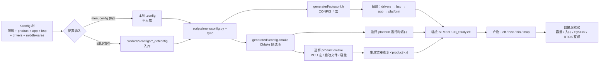
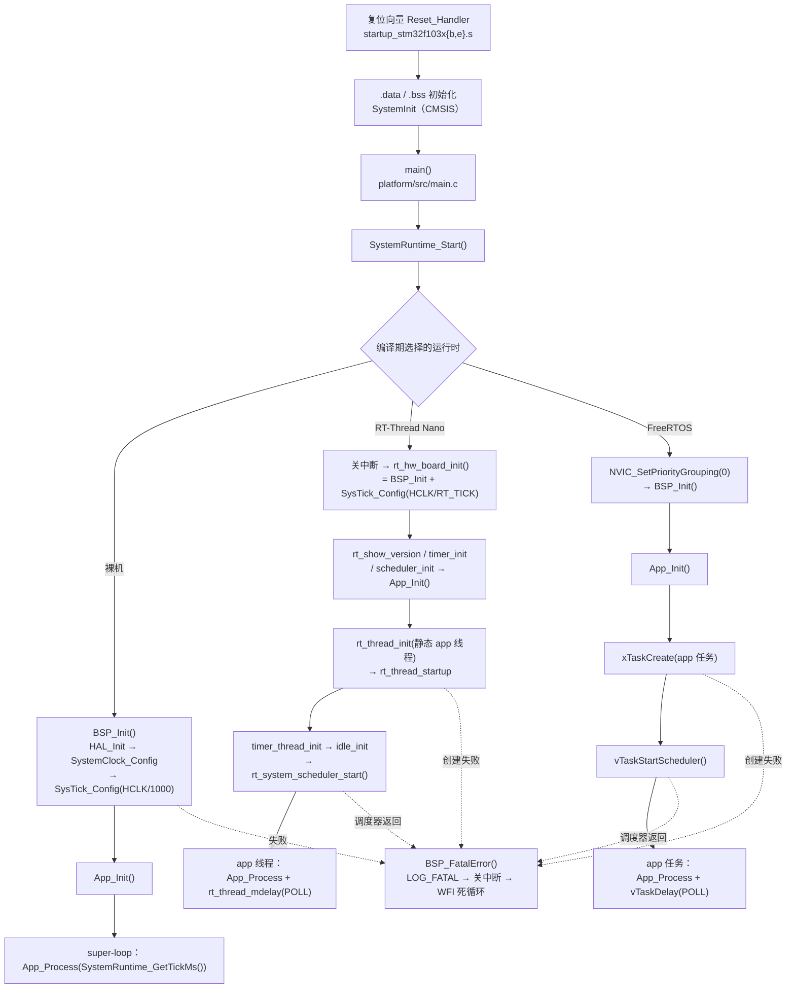
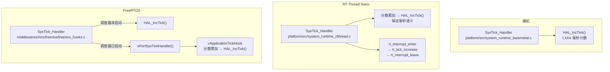

# 固件架构与配置边界

本页描述当前可构建架构。`board_resources/` 中的教程目录和旧工程结构只作为原理参考，
不描述本工程的目录与接口。

---

## 目录

1. [配置模型](#配置模型)
2. [分层依赖与配置注入](#分层依赖与配置注入)
3. [配置唯一来源](#配置唯一来源)
4. [从配置到固件的数据流](#从配置到固件的数据流)
5. [启动流程](#启动流程)
6. [时基所有权](#时基所有权)
7. [错误处理](#错误处理)
8. [扩展规则](#扩展规则)
9. [构建与发布边界](#构建与发布边界)

---

## 配置模型

产品选择和系统选择是两个**正交的 Kconfig choice**：

- **产品**是 MCU、存储布局、时钟和板载资源的唯一来源；
- **系统**只决定运行时端口和内核；
- 固定 defconfig 用于回归与发布，本地 `.config` 用于开发调试。

| 产品 | MCU | Flash / SRAM | 主 LED | 应用按键 | 控制台 | HSE |
| --- | --- | --- | --- | --- | --- | --- |
| `bluepill_f103c8` | STM32F103C8T6 | 64 KB / 20 KB | PC13，低有效 | 无 | USART1 PA9/PA10 | 8 MHz |
| `atk_elite_f103ze`（默认） | STM32F103ZET6 | 512 KB / 64 KB | PB5，低有效 | PE4，低有效上拉 | USART1 PA9/PA10 | 8 MHz |

两个产品都锁定 8 MHz HSE、PLL ×9、SYSCLK 72 MHz。精英板的 PE5(LED1)、PE3(KEY1)
和 PA0(WK_UP) 也记录在产品资源头中，但当前示例应用只使用主 LED 与 KEY0。BluePill
只有 NRST 板载按键，因此 `BSP_USING_KEY` 与 `APP_ENABLE_BUTTON_TASK` 在该产品下不可选。

---

## 分层依赖与配置注入

```mermaid
flowchart TB
    subgraph CFG["配置注入（编译期常量）"]
        KCFG["顶层 Kconfig<br/>product / app / bsp / drivers / middlewares"]
        DEF["product/&lt;product&gt;/configs/*_defconfig<br/>可复现配置（入库）"]
        DOT["本地 .config<br/>开发调试（不入库）"]
        KCFG --> DEF
        KCFG --> DOT
    end

    subgraph LAYERS["固件分层（依赖只能向下）"]
        PLAT["platform<br/>唯一 main、调度器、任务包装、SysTick"]
        APP["app<br/>App_Init / App_Process(now_ms)"]
        BSP["bsp<br/>板级外设，不判断芯片型号"]
        DRV["drivers<br/>CMSIS + 精简 HAL"]
        PROD["product<br/>静态资源与构建参数"]
    end

    PLAT --> APP --> BSP --> DRV
    DRV -.依赖.-> PROD
    BSP -.依赖.-> PROD
    CFG -.生成 autoconf.h 与 kconfig.cmake.-> LAYERS
    PROD -.product.cmake.-> BUILD["CMake 目标<br/>MCU 宏、启动文件、链接脚本"]
```

层次约束（自上而下单向依赖，禁止反向引用）：

1. `product`：只提供静态资源和构建参数，不含业务逻辑与 RTOS 代码。
2. `drivers`：依赖产品配置和 CMSIS，不依赖 BSP、应用或 RTOS。
3. `bsp`：依赖驱动，只使用产品资源宏与能力宏，不得直接判断 `STM32F103xB/xE`。
4. `app`：依赖 BSP，只暴露 `App_Init()` 和非阻塞 `App_Process(uint32_t now_ms)`，
   **禁止包含任何 RT-Thread 或 FreeRTOS 头文件**。
5. `platform`：负责 `main`、调度器、任务包装和 SysTick，并选择唯一 RTOS 内核。

---

## 配置唯一来源

| 配置内容 | 唯一来源 | 生成或消费位置 |
| --- | --- | --- |
| 产品选择、系统选择、功能开关 | 顶层 `Kconfig` 与各层 `Kconfig` | `build/out/<preset>/generated/autoconf.h`、`kconfig.cmake` |
| MCU 宏、容量、启动文件、链接长度 | `product/*/product.cmake` | CMake 目标与生成的链接脚本 |
| 时钟、引脚、有效电平、上下拉、板载能力 | `product/*/include/product_config.h` | drivers 与 BSP |
| 应用入口与轮询接口 | `app/inc/app_task.h` | 三个运行时端口 |
| `main`、调度器、SysTick | `platform/src/` | 最终固件 |
| 链接脚本 | `product/linker.ld.in` | 由 CMake 按产品参数生成到构建目录 |

> 禁止在源码里复制产品内存大小或板级引脚。所有差异必须来自上述唯一来源。

---

## 从配置到固件的数据流



关键约束：

- 每个 preset 拥有独立构建目录，生成的 `autoconf.h` 不会互相覆盖。
- `.config` 只被 `configured-debug` 消费；其余 preset 直接读取产品 defconfig。
- `.config` 不存在时，`cmake/stm32f103_options.cmake` 回退到
  **`product/atk_elite_f103ze/configs/baremetal_defconfig`**。

---

## 启动流程

`platform/src/main.c` 是全工程唯一的 `main()`，只调用 `SystemRuntime_Start()`；
三个运行时端口各自提供该函数的实现。



要点：

- `BSP_Init()` 是三个端口共用的板级入口，负责 HAL、时钟、SysTick 默认配置、
  LED/KEY/USART 初始化和日志初始化。
- 应用只被 `App_Init()` 初始化一次，之后统一由非阻塞 `App_Process(now_ms)` 推进。
- 任务/线程栈、优先级、轮询周期和内核参数全部来自 Kconfig 生成的 `CONFIG_*`。
- 调度器正常启动后不会返回；返回即视为致命错误。

---

## 时基所有权

`BSP_Init()` 先把 SysTick 配成 1 kHz 驱动 HAL 毫秒 tick。随后各运行时按自己的
节拍重新配置，**同一时刻只有一个 SysTick 入口**。



规则：

- 只有 `platform/`（裸机、RT-Thread）和 FreeRTOS 钩子文件可以定义 `SysTick_Handler`；
  startup、BSP 和应用**不得**定义或重配 SysTick。
- 内核 tick 不等于 1000 Hz 时用分数累加换算，应用侧恒以毫秒为单位。
- `SystemRuntime_GetTickMs()` 在三个端口都返回 HAL 毫秒计数，应用无感差异。

---

## 错误处理

- `BSP_FatalError(reason)`：打印 FATAL 日志 → `__disable_irq()` → `WFI` 死循环。
- 触发点：`BSP_Init()` 失败、SysTick 配置失败、线程/任务创建失败、调度器返回、
  FreeRTOS 堆分配失败或栈溢出。
- 时钟、任务创建或调度器启动失败后**不会**以未知时钟或半初始化状态继续运行。

---

## 扩展规则

**新增产品**：必须提供产品头（`product_config.h`）、CMake 元数据（`product.cmake`）、
三类系统 defconfig 和 6 个 preset，并通过完整矩阵。流程见
[产品板级配置](../product/README.md)。

**新增 BSP 外设**：必须使用产品能力宏，由 Kconfig 控制源码与初始化，CMake 用
`target_sources()` 显式登记。流程见
[SOP-04](../docs/SOP_development_standard_procedure.md#sop-04新增外设模块与-bsp-驱动开发规范)。

**新增第三方组件**：必须具备固定版本源码、许可证、目标平台端口和至少一个可运行
验证；不得为缺失源码的目录创建可选功能。

**共享逻辑**：需要在三种系统间复用的功能实现为非阻塞状态机，由
`App_Process(now_ms)` 推进；确实只适用于某个 RTOS 的任务、队列或同步封装放到
`platform`，再向应用暴露与内核无关的接口。

---

## 构建与发布边界

- CMake/Ninja 是唯一构建定义；顶层 `Makefile` 和 `build/*.bat` 只是入口包装。
- 固定 preset 直接读取产品 defconfig；只有 `configured-debug` 读取本地 `.config`。
- 每次链接后由 `scripts/check_firmware.py` 检查：Flash/RAM 上限、
  `Reset_Handler`/`SysTick_Handler`/`main` 存在、RTOS 符号互斥性。
- 发布前运行 `build\build.bat all` 或 `python scripts/build_matrix.py`，保证
  2 产品 × 3 系统 × Debug/Release = 12 个组合全部通过。
- 烧录、板上时序、按键与串口验证仍需真实硬件完成。
