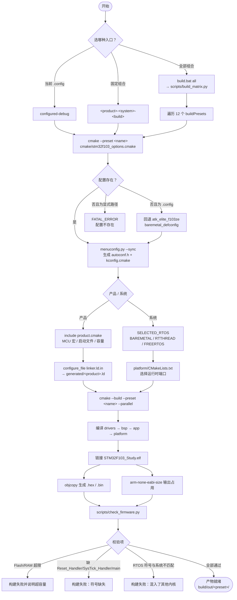

# 01 - CMake + Ninja + GCC 嵌入式编译环境搭建实战

## 1. 为什么选择 CMake + Ninja 架构？
传统的 Keil MDK / IAR 属于专有 IDE，跨平台支持差、无法便捷接入 CI/CD，且工程文件与配置强耦合。
使用 **CMake + Ninja + arm-none-eabi-gcc** 可以带来以下核心优势：
1. **极速构建**：Ninja 基于 DAG 依赖图执行并行编译，秒级完成大型嵌入式工程构建。
2. **可移植构建描述**：CMake 规则可跨平台复用；当前入库的工具二进制与 preset
   已在 Windows 验证。
3. **宏与模块化管理**：通过 Kconfig 和目标级 CMake 配置管理产品、RTOS 与外设组件。
4. **易于自动化与集成**：无缝对接 VS Code、CLion 以及 GitHub Actions。

---

## 2. 工具链准备与环境安装 (Windows 环境)

Windows 仓库已包含 `tools/cmake`、`tools/ninja` 和 `tools/toolchain`，正常情况下可
直接运行 `build\build.bat`，不要求把这些工具加入系统 `PATH`。以下安装步骤主要
用于更新仓库工具或在 Linux/macOS 上复现环境。后两者需要自行放入对应平台的
仓库内工具链，并用 `CMakeUserPresets.json` 覆盖 Windows 专用的 Ninja 路径后验证。

### 必须工具列表
1. **GNU Arm Embedded Toolchain (`arm-none-eabi-gcc`)**
   - 推荐版本：10.3+ / 12.3+
   - 下载地址：[Arm GNU Toolchain Downloads](https://developer.arm.com/downloads/-/arm-gnu-toolchain-downloads)
   - 验证命令：`arm-none-eabi-gcc -v`
2. **CMake (3.20+)**
   - 下载地址：[CMake Official](https://cmake.org/download/)
   - 验证命令：`cmake --version`
3. **Ninja 构建工具**
   - 下载地址：[Ninja Releases](https://github.com/ninja-build/ninja/releases)
   - 验证命令：`ninja --version`
4. **调试与烧录工具：SEGGER J-Link**
   - 本工程烧录与调试只使用 `JLink.exe`，**不需要安装 OpenOCD 或 ST-Link**。
   - 安装 SEGGER J-Link Software 后，`scripts/flash.bat` 会自动从 `JLINK_DIR`、
     `PATH` 或默认安装路径定位 `JLink.exe`。

> [!TIP]
> CMake、Ninja 和 GNU Arm 工具链已随仓库提供，通常无需加入系统 `PATH`。
> 只有在更换仓库内工具版本时，才需要自行放置并验证。

---

## 3. 本工程 CMake 编译命令实战

### 方式一：使用 CMake Presets (推荐)
本工程根目录下已配置 `CMakePresets.json`：

```bash
# 1. 裸机 Debug 模式配置与编译
cmake --preset bluepill-baremetal-debug
cmake --build --preset bluepill-baremetal-debug

# 2. RT-Thread Nano 模式配置与编译
cmake --preset bluepill-rtthread-debug
cmake --build --preset bluepill-rtthread-debug

# 3. FreeRTOS 模式配置与编译
cmake --preset bluepill-freertos-debug
cmake --build --preset bluepill-freertos-debug
```

### 方式二：标准命令行手动配置
```bash
# 1. 生成构建配置（显式指定 Ninja、工具链与构建目录）
cmake -B build/out/manual -G Ninja \
      -DCMAKE_TOOLCHAIN_FILE=cmake/arm-none-eabi-gcc.cmake \
      -DCMAKE_BUILD_TYPE=Debug \
      -DPROJECT_CONFIG_FILE=product/bluepill_f103c8/configs/baremetal_defconfig

# 2. 执行编译
cmake --build build/out/manual

# 3. 查看输出产物
# 产物位于 build/out/manual/STM32F103_Study.{elf,hex,bin,map}
```

手动 `-B` 只适合临时验证，不会写入 `CMakePresets.json`。日常开发使用 preset，
产物一律位于 `build/out/<preset>/STM32F103_Study.{elf,hex,bin,map}`，不会与其他
组合互相覆盖。

> [!NOTE]
> 手动模式需要自行保证 Ninja 可用。preset 通过 `CMAKE_MAKE_PROGRAM` 指向仓库内的
> `tools/ninja/ninja.exe`，因此优先使用 preset。

### 方式三：项目包装脚本

```bat
build\build.bat bluepill-baremetal-debug
build\build.bat atk-elite-freertos-release
build\build.bat all
```

`all` 构建两个产品、三种系统和 Debug/Release 共 12 个固定组合。每个 ELF 链接后
都会执行容量、入口/SysTick 和 RTOS 符号互斥检查。GNU Make 只是相同 preset 的
便捷包装，不维护第二套源码清单。

---

## 4. Preset 命名与默认行为

```text
<bluepill|atk-elite>-<baremetal|rtthread|freertos>-<debug|release>
configured-debug        # 读取本地 .config
```

| Preset | 配置输入 | 说明 |
| --- | --- | --- |
| `configured-debug` | 仓库根 `.config` | 日常开发；`.config` 不存在时回退到 **正点原子精英板 + 裸机** defconfig |
| 其余 12 个 | `product/<product>/configs/<system>_defconfig` | 可复现的回归与发布组合 |

> 回退行为由 `cmake/stm32f103_options.cmake` 实现，改默认产品必须改该文件而不是文档。

---

## 5. 构建与校验流程



链接后校验项由 `scripts/check_firmware.py` 执行：

| 校验 | 判据 | 失败后果 |
| --- | --- | --- |
| Flash 容量 | `text + data ≤ PRODUCT_FLASH_BYTES` | 构建失败 |
| RAM 容量 | `data + bss ≤ PRODUCT_RAM_BYTES` | 构建失败 |
| 必要符号 | `Reset_Handler`、`SysTick_Handler`、`main` 均存在 | 构建失败 |
| RTOS 互斥 | `rt_system_scheduler_start` 与 `vTaskStartScheduler` 只能出现与系统匹配的那一个 | 构建失败 |

---

## 6. 常用命令速查

```bat
REM 单个组合
cmake --preset atk-elite-freertos-debug
cmake --build --preset atk-elite-freertos-debug --parallel

REM Windows 包装脚本
build\build.bat bluepill-baremetal-debug
build\build.bat all
build\clean.bat all

REM GNU Make 包装
make menuconfig
make PRESET=atk-elite-rtthread-release
make matrix
make flash
make clean
```

产物：`build/out/<preset>/STM32F103_Study.{elf,hex,bin,map}`
外加 `compile_commands.json`（`CMAKE_EXPORT_COMPILE_COMMANDS` 已开启）。
