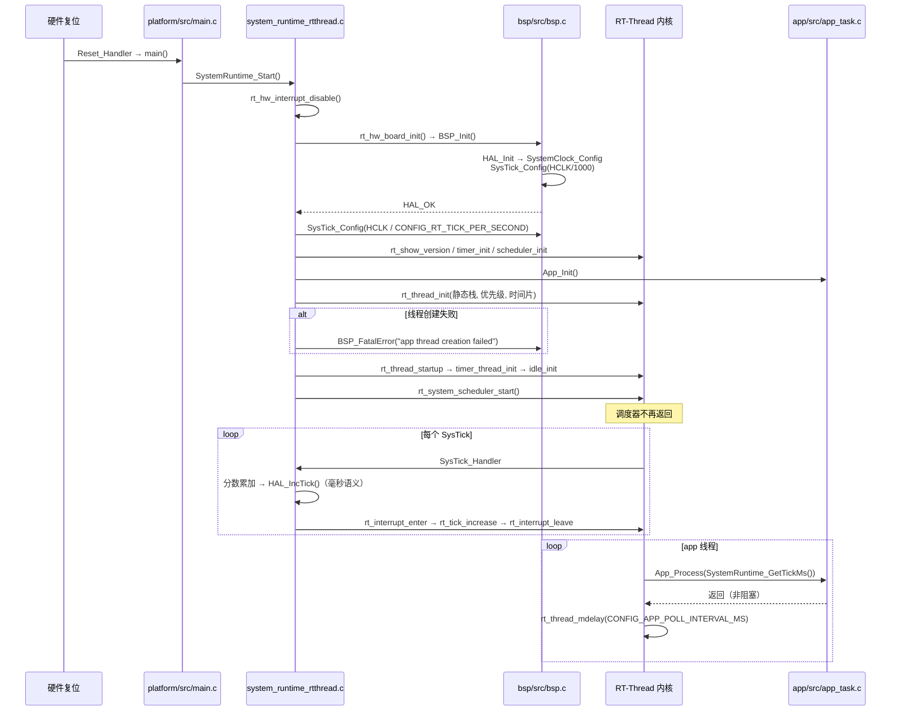

# 02 - RT-Thread Nano 当前端口与扩展指南

当前工程已集成 RT-Thread Nano 3.1.5。产品板型和 RTOS 通过 Kconfig 选择，应用
层无需也不得包含 RT-Thread 头文件。

## 构建现有端口

```bash
cmake --preset bluepill-rtthread-debug
cmake --build --preset bluepill-rtthread-debug

cmake --preset atk-elite-rtthread-debug
cmake --build --preset atk-elite-rtthread-debug
```

也可在 `make menuconfig` 中选择产品和 `RT-Thread Nano`，再构建
`configured-debug`。固定回归配置位于各产品的 `configs/rtthread_defconfig`。

## 当前实现职责

| 位置 | 职责 |
| --- | --- |
| `platform/src/main.c` | 唯一 `main()`，调用 `SystemRuntime_Start()` |
| `platform/src/system_runtime_rtthread.c` | 板级初始化、内核初始化、应用线程、SysTick 和控制台端口 |
| `middlewares/rtos/rt-thread/` | RT-Thread Nano 内核与 Cortex-M3 GCC 端口 |
| `app/src/app_task.c` | 共享的 `App_Init()`、非阻塞 `App_Process(now_ms)` |
| `product/*` | MCU、内存、启动文件、时钟、引脚和产品能力 |

`rt_hw_board_init()` 调用 `BSP_Init()` 并按 `CONFIG_RT_TICK_PER_SECOND` 配置
SysTick。`SysTick_Handler()` 同时推进 RT-Thread tick 和 HAL 毫秒 tick；当内核
tick 不是 1000 Hz 时使用分数累加换算，应用仍收到毫秒时间。

运行时创建唯一的 `app` 静态线程，栈、优先级和时间片由 Kconfig 控制。线程循环
调用 `App_Process(SystemRuntime_GetTickMs())`，并按 `CONFIG_APP_POLL_INTERVAL_MS`
休眠。控制台启用时，`rt_hw_console_output()` 转发到 BSP USART1。

## 运行时序



时基要点：

- `BSP_Init()` 先把 SysTick 配成 1 kHz；`rt_hw_board_init()` 随后按
  `CONFIG_RT_TICK_PER_SECOND` 重新配置。
- `SysTick_Handler()` 用分数累加把任意内核 tick 频率换算成 HAL 毫秒 tick，应用
  侧恒以毫秒为单位。
- 内核 tick 不等于 1000 Hz 时，`SystemRuntime_DelayMs()` 仍经 `rt_thread_mdelay()`
  换算，无需修改应用。

## 扩展规则

1. 通用业务优先写成 `App_Process()` 驱动的非阻塞状态机，保持三系统复用。
2. 必须使用 RT-Thread 原语的代码放在 `platform` 的 RT-Thread 专用实现中，不把
   `rtthread.h` 传播到 `app`、`bsp` 或 `drivers`。
3. 不在 startup、BSP 或应用中再次定义 `SysTick_Handler`、`PendSV_Handler` 或
   RT-Thread 已接管的异常入口。
4. 新增线程参数应进入 Kconfig，并由生成的 `CONFIG_*` 宏消费；不要在源码中复制
   产品内存大小或板级引脚。
5. 端口修改后至少构建两个产品的 RT-Thread Debug/Release，并运行完整矩阵。

## 验收

- 链接后只有一个 `main` 和一个 `SysTick_Handler`。
- ELF 含 RT-Thread 调度符号，不含 FreeRTOS 调度符号。
- 串口启动日志显示选中的产品、`RT-Thread Nano` 和 72 MHz 实际时钟。
- LED 心跳周期正确；精英板 KEY0 去抖和日志正常；BluePill 不出现用户按键选项。
- Flash/RAM 未超过产品容量，调度器启动失败时进入 `BSP_FatalError()`。
