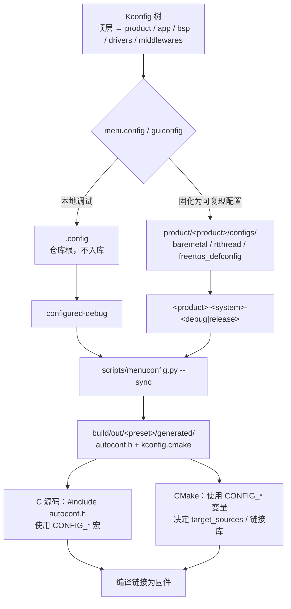
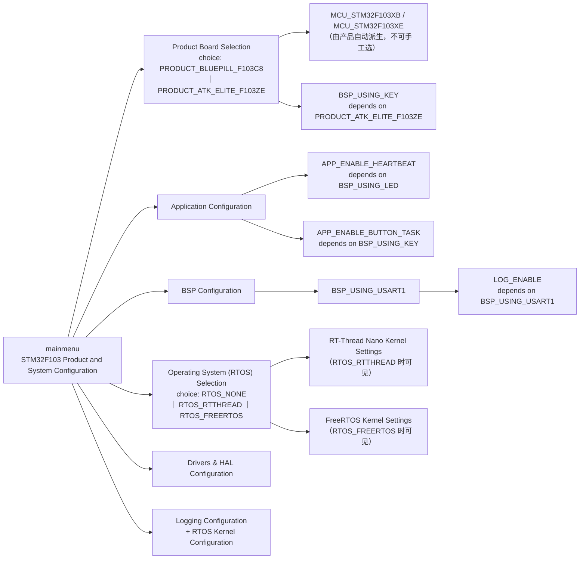

# 04 - Kconfig 产品与系统配置指南

Kconfig 是本工程唯一的裁剪入口。产品与系统是两个互斥 `choice`，生成的 `CONFIG_*`
宏同时驱动 C 源码和 CMake 源码清单。

---

## 配置流



要点：

- `.config` 是开发者本地选择，**不入库**；产品目录下的六份 defconfig 是自动回归
  与发布构建输入。
- 生成文件留在独立构建目录，多个配置可并行存在、互不覆盖。
- `.config` 缺失时，`cmake/stm32f103_options.cmake` 回退到
  **正点原子精英板 + 裸机** defconfig；显式指定却不存在的配置文件会直接报错。

---

## 菜单结构与依赖



常用选项一览：

| 菜单项 | 默认 | 约束 |
| --- | --- | --- |
| `Product Board Selection` | `PRODUCT_ATK_ELITE_F103ZE` | 同时决定 MCU 宏、容量、启动文件、时钟、引脚与板载能力 |
| `RTOS Mode` | `RTOS_NONE` | 只决定运行时端口与内核 |
| `BSP_USING_LED` / `BSP_USING_USART1` | y | 依赖 HAL GPIO / UART |
| `BSP_USING_KEY` | 精英板 y、BluePill 不可选 | `depends on PRODUCT_ATK_ELITE_F103ZE` |
| `APP_POLL_INTERVAL_MS` | 10 | 影响三系统的轮询/休眠周期 |
| `LOG_LEVEL` | 3（INFO） | `depends on LOG_ENABLE` |

BluePill 没有板载用户按键，因此其按键相关选项在菜单中不可见。产品选择同时确定
MCU 宏、时钟、存储容量、链接参数和板级资源，**不能**再独立选择不匹配的芯片。

---

## 使用 menuconfig

```bash
python scripts/menuconfig.py          # 终端交互
python scripts/menuconfig.py --gui    # 图形界面
make menuconfig                       # GNU Make 包装
make guiconfig
```

选择顺序：

1. `Product Board Selection`：BluePill C8 或正点原子精英 ZE。
2. `Operating System (RTOS) Selection -> RTOS Mode`：裸机、RT-Thread Nano 或 FreeRTOS。
3. 应用、BSP、日志和所选 RTOS 的内核参数。

退出时保存即写入根目录 `.config`；CMake 会在配置阶段自动调用
`scripts/menuconfig.py --sync` 重新生成头文件，无需手工执行。

---

## 构建当前配置与固定配置

```bash
# 当前 .config；缺失时回退到正点原子精英板裸机
cmake --preset configured-debug
cmake --build --preset configured-debug

# 固定可复现配置
cmake --preset atk-elite-freertos-debug
cmake --build --preset atk-elite-freertos-debug
```

`build/build.bat all` 或 `python scripts/build_matrix.py` 会构建两个产品、三个系统
的 Debug/Release 共 12 个镜像。

---

## 新增选项规则

- Kconfig 名称经 `autoconf.h` 变成 `CONFIG_<NAME>` 宏，大小写保持一致。
- C 与 CMake 必须实际消费新增选项；不得保留无效果的菜单。
- 新选项必须写清 `depends on`：产品能力决定硬件项是否可见，RTOS 选择决定内核
  参数是否可见。
- CMake 使用目标级 `target_sources()`、`target_include_directories()` 和
  `target_link_libraries()`，禁止恢复全局宏或 `GLOB_RECURSE`。
- 每份 Kconfig 必须从父 Kconfig 显式 `source`，否则菜单不会出现。
- 新产品必须提供产品头、CMake 元数据和三种系统 defconfig，并通过完整矩阵。
- 修改共享 Kconfig 后，运行 `build/build.bat all` 验证 12 个组合。
