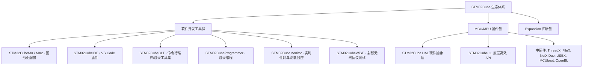

# STM32CubeMX Data Brief (DB2163) - STM32 配置与初始化 C 代码生成工具

> **文档编号**：DB2163 - Rev 22 (May 2026)  
> **文档类型**：Data brief (数据简报)  
> **官方主页**：[ST STM32CubeMX](https://www.st.com/content/st_com/en/stm32cubemx.html)

---

## 📌 概述 (Description)

**STM32CubeMX**（包含 STM32CubeMX 与 STM32CubeMX2）是意法半导体（STMicroelectronics）推出的一款图形化配置工具。它通过向导式的分步流程，极大地简化了 STM32 系列 MCU / MPU 产品的初始化配置与 C 代码生成：

1. **选型阶段**：选择符合外设需求的 STM32 微控制器、微处理器或官方开发板平台，或者直接选择特定硬件平台上的示例工程。
2. **交互配置阶段**：
   - **GPIO 引脚配置**：图形化引脚映射与冲突自动解决机制。
   - **时钟树配置**：提供动态约束校验和时钟求解器（Configuration Solver）。
   - **外设与中间件配置**：动态校验参数约束，配置外设工作模式及中间件协议栈。
3. **扩展包生态**：通过内置的 Package Manager 在线下载或从本地安装 STM32Cube Expansion Packages（官方与第三方扩展包）。
4. **代码生成**：生成高质量、无语法冲突的初始化 C 代码工程。

---

## ✨ 核心特性 (Features)

- **强大直观的图形用户界面 (GUI)**：
  - **引脚分配 (Pinout)**：支持自动冲突检测与自动重映射提示。
  - **外设与中间件模式**：实时动态校验参数合法性与依赖约束。
  - **时钟树 (Clock Tree)**：提供全时钟链路实时验证与自动时钟频率求解器。
- **大幅缩短开发周期**：针对所有受支持的 STM32 外设自动生成免错（error-free）的初始化代码。
- **主流 IDE 与工具链支持**：
  - **IAR Embedded Workbench®**
  - **Keil MDK-ARM**
  - **STM32CubeIDE** (以及 CMake / Makefile 兼容生成)
- **多操作系统跨平台支持**：
  - Windows®
  - Linux®
  - macOS®
- **集成 STM32Cube Expansion Packages**：方便扩展算法、传感器驱动与上层中间件。

---

## 🌐 什么是 STM32Cube 生态系统？ (What is STM32Cube?)

STM32Cube 是 ST 旨在通过降低开发难度、缩短开发时间与成本来提高设计人员生产力的综合生态系统，覆盖全系列 STM32 产品线。

### 1. 软件开发工具集
- **STM32CubeMX**：图形化配置与 C 初始化代码生成工具。
- **STM32CubeIDE**：基于 Eclipse® 的一站式集成开发环境，具备编辑、编译、烧录和高级调试能力。
- **STM32CubeCLT**：面向自动化 CI/CD 与脚本开发的全功能命令行工具集。
- **STM32CubeIDE for Visual Studio Code (STM32VSCode)**：基于 VS Code® 平台的全功能嵌入式开发扩展。
- **STM32CubeProgrammer (STM32CubeProg)**：支持图形化与命令行的通用芯片烧录与 Option Bytes 配置工具。
- **STM32CubeMonitor**：实时监控和调优应用运行表现、功耗分析（MonPwr）、射频特性（MonRF）与 USB-PD（MonUCPD）。
- **STM32CubeWiSE**：评估和测试蓝牙 BLE、Sub-GHz、IEEE 802.15.4 等无线射频协议。

### 2. MCU 与 MPU 固件支持包
- **HAL (Hardware Abstraction Layer)**：提供高度通用、可跨 STM32 家族移植的硬件抽象层 API。
- **LL (Low-Layer APIs)**：轻量、高效、接近寄存器操作的底层驱动 API。
- **中间件套件**：涵盖 Azure RTOS (ThreadX, FileX, LevelX, NetX Duo, USBX)、USB-PD、mbed-crypto、MCUboot 与 OpenBL。
- **示例与例程**：针对各个外设与场景提供完整的配套应用案例。

---

## 🛒 获取与订购信息 (Ordering Information)

STM32CubeMX 可在意法半导体官方网站免费下载：
- **产品主页**：[www.st.com/en/product/stm32cubemx](https://www.st.com/en/product/stm32cubemx)
- **开发者专区**：[www.st.com/stm32cubemx](https://www.st.com/stm32cubemx)

---

## 📜 许可协议 (License)

STM32CubeMX 遵循 ST **SLA0048** 软件许可协议及附加条款发布。
可在 Windows®、Linux® 或 macOS® 操作系统上运行，用于配置基于 Arm® Cortex® 内核的 STM32 微控制器与微处理器。
