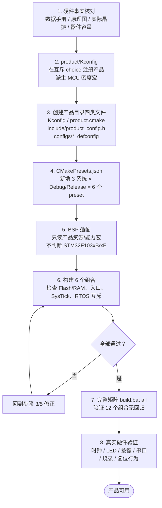

# 产品板级配置

`product/` 是产品差异的唯一来源。它描述 MCU、存储、启动文件、链接参数、时钟、
板载引脚和硬件能力，不包含业务逻辑或 RTOS 代码。

## 当前产品

| 目录 | MCU | Flash / SRAM | 板载应用资源 |
| --- | --- | --- | --- |
| `bluepill_f103c8/` | STM32F103C8T6 | 64 KB / 20 KB | PC13 LED、USART1；无用户按键 |
| `atk_elite_f103ze/` | STM32F103ZET6 | 512 KB / 64 KB | PB5/PE5 LED、PE4/PE3/PA0 按键、USART1 |

每个产品目录必须包含：

```text
<product>/
├── Kconfig
├── product.cmake
├── include/product_config.h
└── configs/
    ├── baremetal_defconfig
    ├── rtthread_defconfig
    └── freertos_defconfig
```

- 顶层 `product/Kconfig` 注册产品与 MCU 密度；产品目录内的 `Kconfig` 当前是预留
  扩展入口，尚未承载活动选项。新增选项时还必须从 Kconfig 树显式 `source`。
- `product.cmake` 提供产品 ID、MCU 编译宏、Flash/RAM 容量、启动文件、链接长度
  和产品头目录。
- `product_config.h` 提供 HSE/SYSCLK、GPIO、有效电平、上下拉和外设实例等静态
  硬件事实。
- 三份 defconfig 是可复现构建输入；本地 `.config` 不能替代它们入库。
- `linker.ld.in` 由 CMake 使用产品参数生成到各构建目录，不为每个产品复制链接
  脚本。

## 新增产品流程



步骤说明：

1. 在 `product/Kconfig` 的互斥 choice 中注册产品，并生成正确的 MCU 密度选项。
2. 创建上述四类文件，核对数据手册、原理图、实际晶振和器件容量。
3. BSP 只读取产品资源/能力宏，不直接判断 `STM32F103xB/xE`。
4. 在 `CMakePresets.json` 增加三系统的 Debug/Release preset
   （`build_matrix.py` 自动遍历 `buildPresets`，无需改脚本）。
5. 构建六个组合，检查 Flash/RAM、启动入口、SysTick 和 RTOS 符号互斥。
6. 在真实硬件验证时钟、LED、按键、串口、烧录和复位行为。

> 顶层 `product/Kconfig` 必须 `source` 新产品目录的 Kconfig，否则菜单不会出现。
